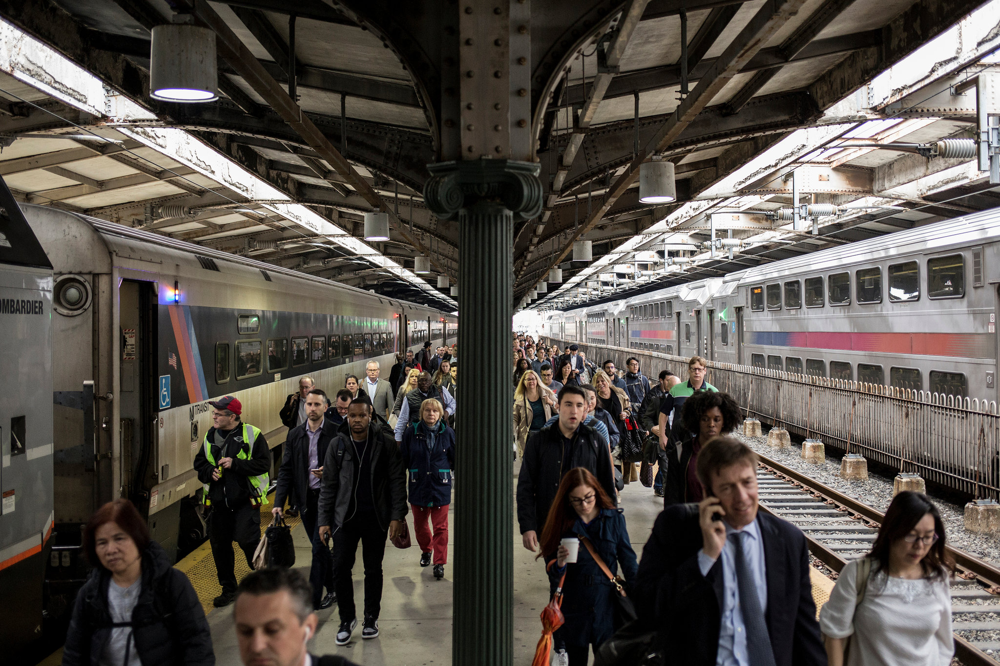
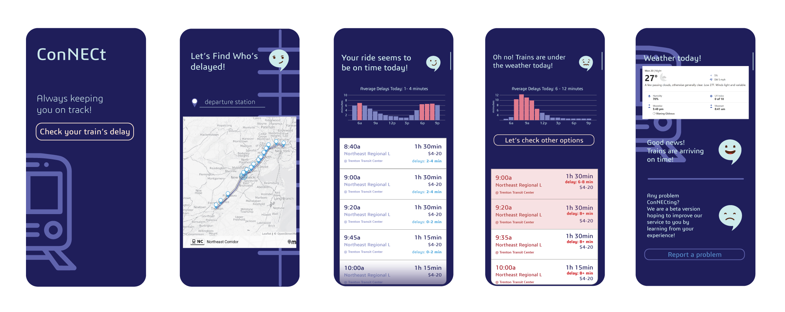

*Image source: The New York Times (2018)*

```{r loading packages, message=FALSE, warning=FALSE, include=FALSE}
library(tidyverse)
library(sf)
library(lubridate)
library(tigris)
library(tidycensus)
library(viridis)
library(riem)
library(gridExtra)
library(knitr)
library(kableExtra)
library(gganimate)
library(gifski)
library(caret)
library(ckanr)
library(kableExtra)
library(stargazer)
library(spdep)
library(FNN)
library(grid)
library(ggcorrplot)
library(jtools) 
library(maptools)
library(broom)
library(dplyr)
library(nngeo)
library(geosphere)
library(zoo)
library(ggstance)
library(scales)
library(ggpubr)
library(xtable)
library(ggmap)
library(leaflet)
library(leaflet.providers)
library(expss)

plotTheme <- theme(
  plot.title =element_text(size=10, face = 'bold'),
  plot.subtitle = element_text(size=8),
  plot.caption = element_text(size = 6),
  axis.text.x = element_text(size = 10, angle = 45, hjust = 1),
  axis.text.y = element_text(size = 10),
  axis.title.y = element_text(size = 10),
  # Set the entire chart region to blank
  panel.background=element_blank(),
  plot.background=element_blank(),
  #panel.border=element_rect(colour="#F0F0F0"),
  # Format the grid
  panel.grid.major=element_line(colour="grey80",size=.2),
  axis.ticks=element_blank())
plotTheme2 <- function(base_size = 10, title_size = 12){
  theme(
    text = element_text(family = 'font', color = "black"),
    plot.title = element_text(family = 'font',
                              size = title_size, colour = "black", face="bold"), 
    plot.subtitle = element_text(size=8),
    plot.caption = element_text(size=6),
    axis.ticks = element_blank(),
    panel.background = element_blank(),
    panel.grid.major = element_line("grey80", size = 0.2),
    panel.grid.minor = element_blank(),
    #panel.border = element_rect(color = "black", fill=NA, size=.5),
    strip.background = element_blank(),
    strip.text = element_text(family = 'font', size=9),
    axis.title = element_text(family = 'font', size=9),
    axis.text = element_text(family = 'font', size=8),
    plot.background = element_blank(),
    legend.background = element_blank(),
    legend.title = element_text(family = 'font', colour = "black", face = "italic"),
    legend.text = element_text(family = 'font', colour = "black", face = "italic"),
    strip.text.x = element_text(family = 'font', size = 9),
    legend.key.size = unit(.3, 'line')
  )
}

mapTheme2 <- function(base_size = 10, title_size = 12) {
  theme(
    text = element_text( color = "black"),
    plot.title = element_text(size = title_size,colour = "black", face="bold"),
    plot.subtitle=element_text(size=8),
    plot.caption=element_text(hjust=0),
    axis.ticks = element_blank(),
    panel.background = element_blank(),axis.title = element_blank(),
    axis.text = element_blank(),
    axis.title.x = element_blank(),
    axis.title.y = element_blank(),
    panel.grid.minor = element_blank(),
    panel.border = element_rect(colour = "black", fill=NA, size=1),
    strip.background = element_blank(),
    strip.text.x = element_text(size = 8.5))
}

mapTheme <- theme(plot.title =element_text(size=12),
                  plot.subtitle = element_text(size=8),
                  plot.caption = element_text(size = 6),
                  axis.line=element_blank(),
                  axis.text.x=element_blank(),
                  axis.text.y=element_blank(),
                  axis.ticks=element_blank(),
                  axis.title.x=element_blank(),
                  axis.title.y=element_blank(),
                  panel.background=element_blank(),
                  panel.border=element_blank(),
                  panel.grid.major=element_line(colour = 'transparent'),
                  panel.grid.minor=element_blank(),
                  legend.direction = "vertical", 
                  legend.position = "right",
                  plot.margin = margin(1, 1, 1, 1, 'cm'),
                  legend.key.height = unit(1, "cm"), legend.key.width = unit(0.2, "cm"))

palette7 <- c("#34A1C7", "#9A77CF", "#543884", "#262254", "#A13670", "#EC4176",  "#FFA45E")
palette6 <- c("#CC777A","#B74B8C","#8261A5", "#34559E", "#E8863D", "#F0B284")
palette2 <- c("#34A1C7", "#9A77CF")


# Load Quantile break functions
qBr <- function(df, variable, rnd) {
  if (missing(rnd)) {
    as.character(quantile(round(df[[variable]],0),
                          c(.01,.2,.4,.6,.8), na.rm=T))
  } else if (rnd == FALSE | rnd == F) {
    as.character(formatC(quantile(df[[variable]]), digits = 4),
                 c(.01,.2,.4,.6,.8), na.rm=T)
  }
}
q5 <- function(variable) {as.factor(ntile(variable, 5))}
```

# 1. Our Approach

**Premise**

NJ Transit is one of the largest state-owned public transportation systems in the US. The Northeast Corridor Line is its busiest, servicing passengers from Trenton to New York's Penn Station. In its [2019 Annual Report](https://data.nj.gov/Transportation/2019-New-Jersey-Transit-Annual-Report/pvhb-pq63), the agency highlighted its focus on improving the customer experience, including the release of key performance metrics to provide more transparency for commuters. 

**Use Case**

An important indicator for rail performance is service reliability, measured by on-time performance statistics. Following commuter rail standard in the Northeast, NJ Transit defines 'on time' as arrival at the final destination within 6 minutes of its scheduled time. In 2019, the recorded on-time performance for the Northeast Corridor Line was 89.5%, putting it in the middle of the list: Main/Bergen and Pascack Valley lines had the best on-time performance at 93.8% while the Atlantic City line had the worst at 85.9%. Still, this was a decrease from its 91.1% on-time performance in 2011. The shared rail space with Amtrak was partly blamed as a cause for [delay](https://www.nj.com/news/2016/08/this_nj_transit_train_line_is_the_worst_at_getting_you_to_work_on_time.html), with Amtrak trains getting priority. Mechanical breakdowns due to years of [underfunding](https://www.nj.com/news/2021/07/breakdowns-now-the-top-cause-for-canceled-nj-transit-trains-neglect-and-underfunding-to-blame.html), heavy rains and severe weather conditions also lead to delays.

**User Interface, App Wireframe**

At ConNECt, we understand that time is of the essence for commuters traveling the Northeast Corridor (NEC). We want to help keep you on track. For more information about our app, you can find our video presentation [HERE](https://www.youtube.com/watch?v=zGXYVmqVcgE).



# 2. Our Data

## 2.1 NJ Transit Stops
Although NJ Transit provides passenger service on 12 rail lines, we are only focusing on its Northeast Corridor Line. In 2018, [the average weekday passenger boardings](https://www.myleszhang.org/files/2019/03/Weekday-Ridership-Statistics-21z2n4i-1h26kh2.pdf) for the NEC reached 120,750, with the busiest stations being New York Penn and Newark Penn recording 43,375 and 19,729 respectively.
```{r station load,  echo=FALSE, message = FALSE, warning = FALSE, include=FALSE} 
njTransStops <- st_read("~/GitHub/MUSA-508/Rail_Stations_of_NJ_Transit.geojson", stringsAsFactors=FALSE)

```

```{r station_plot,  echo=FALSE, message = FALSE, warning = FALSE, fig.width=8, fig.align='center'} 
#select NE
stops <- njTransStops %>%
  filter(LINE_CODE == "NE")%>%
  dplyr::select(STATION_ID, LATITUDE, LONGITUDE)

# bounding box coordinates
nj_bb <- c(
  left = -75.11,
  bottom = 40.111689,
  right = -73.53,
  top = 41.302571)

map <- get_stamenmap( nj_bb, zoom = 9, maptype = "toner-lite")

ggmap(map) +  geom_point(data=stops, mapping = aes(x=LONGITUDE, y=LATITUDE), color="#34A1C7", size=2.5)+
   labs(title="Northeast Corridor Line") +
  mapTheme2()

```

## 2.2 NJ Transit Train Delays

For our Beta release, we are modeling train delays with a two month data sample from January to February 2019 using this [dataset](https://www.kaggle.com/pranavbadami/nj-transit-amtrak-nec-performance?select=2018_11.csv), which contains trip-level performance data for the rail system. 

```{r census,  include=FALSE, message = FALSE, warning = FALSE}
# Install Census API Key
census_api_key("7fcf0c60997f4d8ccd298e26df0b2f35dc033150", overwrite = TRUE)
```

```{r load data, message = FALSE, warning = FALSE, echo=FALSE, include=FALSE}
dat19_01 <- read.csv("~/GitHub/MUSA-508/2019_01.csv", stringsAsFactors=FALSE)
dat19_02 <- read.csv("~/GitHub/MUSA-508/2019_02.csv", stringsAsFactors=FALSE)

njCensus <- 
  get_acs(geography = "county", 
          variables = c("B01003_001"), 
          year = 2019, 
          state = "NJ", 
          geometry = TRUE, 
          output = "wide") 

#get rid of NAs and focus on the Northeast Corridor
dat_all <- rbind(dat19_01, dat19_02) %>% 
  na.omit() %>% 
  filter(line == "Northeast Corrdr" )
```

```{r ridership, message=FALSE, warning=FALSE, include=FALSE}
#Average weekday rail boardings in 2018 - https://www.myleszhang.org/files/2019/03/Weekday-Ridership-Statistics-21z2n4i-1h26kh2.pdf
station <- c("Edison", "Elizabeth", "Hamilton", "Jersey Avenue", "Linden", "Metropark",
                  "Metuchen", "New Brunswick", "New York Penn Station", "Newark Airport",
                  "Newark Penn Station", "North Elizabeth", "Princeton Junction",                          "Rahway","Secaucus Upper Lvl", "Trenton")
                 
boardings <- c("2847", "3431", "5118","1417","2418","7431","3547","4479",
               "43375","4409","19729","786","6679","3218", "6760","3772")

ridership_2018 <- data.frame(station, boardings)
```


## 2.3 Weather Data

Weather events could disrupt rail services [Rossetti (2007)](https://rosap.ntl.bts.gov/view/dot/9745), leading to both economic and financial losses for commuters and railway operators. For example, heavy rains could cause flooding and submerge part of the tracks. Extreme temperatures [could jam up railroads](https://www.theatlantic.com/technology/archive/2019/02/chicago-railroads-fire-tracks/581875/). High winds could make railcars prone to rollovers and derailments. We included the following weather data collected by the Newark Liberty International Airport (EWR): precipitation (inches); wind gust and speed (knots); visibility (miles); and temperature (fahrenheit). 

```{r weather, echo=TRUE, message=FALSE, warning=FALSE}
# get weather data
weather <- riem_measures(station = "EWR", date_start = "2019-01-01", date_end = "2019-02-28") %>% 
  dplyr::select(valid, sknt, p01i, vsby, gust, tmpf)%>%
  replace(is.na(.), 0) %>%
  mutate(interval60 = ymd_h(substr(valid,1,13))) %>%
  mutate(week = week(interval60),
         dotw = lubridate::wday(interval60, label=TRUE)) %>%
  group_by(interval60) %>%
  summarize(Precipitation = sum(p01i),
            Wind_Speed = max(sknt),
            Visibility = max(vsby),
            Wind_Gust = max(gust),
            Temperature = max(tmpf))%>%
mutate(Temperature = ifelse(Temperature == 0, 42, Temperature))
```

```{r weather plots, message=FALSE, warning=FALSE}
grid.arrange(
  ggplot(weather, aes(interval60, Precipitation)) + geom_line(color="#482D81") + 
    labs(title="Precipitation", x="Hour", y="Precipitation") + plotTheme,
  ggplot(weather, aes(interval60, Wind_Speed)) + geom_line(color="#482D81") + 
    labs(title="Wind Speed", x="Hour", y="Wind Speed") + plotTheme,
  ggplot(weather, aes(interval60, Wind_Gust)) + geom_line(color="#482D81")+
    labs(title="Wind Gust", x="Hour", y="Wind Gust") + plotTheme,
  ggplot(weather, aes(interval60, Visibility)) + geom_line(color="#482D81")+
    labs(title="Visibility", x="Hour", y="Visibility") + plotTheme,
  ggplot(weather, aes(interval60, Temperature)) + geom_line(color="#482D81")+
    labs(title="Temperature", x="Hour", y="Temperature") + plotTheme)
```

The plots below visualize the distribution of different weather features for the two-month period. For precipitation, visibility, and wind gust, we see that the distributions are skewed.

```{r weather distribution, warning=FALSE, message=FALSE}
weather %>%
    dplyr::select(interval60, Precipitation, Wind_Speed, Visibility, Wind_Gust, Temperature) %>%
    gather(Variable, value, -interval60) %>%
    ggplot() + 
    geom_density(aes(value, color=NA), fill = "#4FA8DE",alpha=0.8) + 
    facet_wrap(~Variable, scales = "free", ncol=5) +
    scale_color_manual(values = "purple") +
    labs(title = "Weather Distributions") +
  plotTheme2()
```

# 3. Our Data Exploration
We extracted month, day, hour, and other temporal features in our dataset.
```{r data wrangling, message=FALSE, warning=FALSE}
# interval 60
dat_all <- dat_all %>% 
  mutate(scheduled_time = as_datetime(scheduled_time),
         actual_time = as_datetime(actual_time)) %>%
  mutate(train_id = as.numeric(train_id), 
         direction = ifelse(train_id%%2 == 0, "Northbound", "Southbound"), 
         interval60 = floor_date(ymd_hms(scheduled_time), unit = "hour"),
         month = month(interval60), 
         day = day(interval60),
         hour = hour(interval60),
         minute = minute(scheduled_time),  # scheduled time in decimal format
         time = hour + minute/60,
         tod_1 = ifelse(hour > 0 & hour < 7, "Overnight", 
                       ifelse(hour < 9, "AM Peak", 
                              ifelse(hour < 16, "Midday",
                                     ifelse(hour < 19, "PM Peak", "Late Night")))),
         tod_2 = ifelse(hour >7 & hour< 9, "AM Peak", 
                              ifelse(hour > 16 & hour < 19, "PM Peak", "Off Peak")),
         dotw = lubridate::wday(interval60, label = TRUE),
         ontime = ifelse(delay_minutes < 6, "On Time", "Delayed"), 
         # actual month, day, hour, minute
         act_month = month(actual_time),
         act_day = day(actual_time),
         act_hour = hour(actual_time),
         act_minute = minute(actual_time), 
         # actual time in decimal format
         act_time = act_hour + act_minute/60) 
# create a unique identifier for each row with concatenated date and train_id
dat_all$unique <- paste(dat_all$date, dat_all$train_id , sep = " ")

#get unique stops in NEC
NECstops <- as.data.frame(unique(dat_all$to))
#merge to get coordinates
NECstops <- merge(NECstops, stops, by.x="unique(dat_all$to)", by.y="STATION_ID")
#change column names
colnames(NECstops)[1] <- "STATION"
#change to sf
NECstops.sf <- NECstops %>%
  st_as_sf(coords = c("LONGITUDE", "LATITUDE"), crs = 4326, agr = "constant") %>%
  st_transform('ESRI:102711')
```

   
## 3.1 Delays

To account for some variations in service, NJ Transit considers vehicles operating within 6 minutes of published schedule as on time. From this definition, 26% of trains were delayed from Jan to Feb 2019. On average, passengers wait for 4.3 minutes before their trains arrive as scheduled. The longest delay during this period was on 31 January 2019, where passengers on Edison and Jersey Avenue stations had to wait for 86 minutes. 

```{r delay times, warning=FALSE, message=FALSE}
ggplot(dat_all, aes(x=delay_minutes))+
            geom_histogram(binwidth = 0.5, fill = "#482D81", alpha=0.8)+
            labs(x="Minutes", 
                 y="Frequency",
                   title="Delay Time of Trains",
                   subtitle="January to February 2019")+
            plotTheme2()
```
```{r dist of delay times, warning=FALSE, message=FALSE}
ggarrange(ncol=2,
          ggplot(subset(dat_all, delay_minutes<=6))+
            geom_histogram(aes(delay_minutes), binwidth = 0.5, fill = palette2[2], alpha=0.8)+
            #xlim(0, 100) +
            labs(x="Minutes", 
                 y="Frequency",
                   title="Delay Time of Trains",
                   subtitle="On-time (within 6 minutes)")+
            plotTheme2(),
            ggplot(subset(dat_all, delay_minutes > 6))+
              geom_histogram(aes(delay_minutes), binwidth = 0.5, fill = palette2[2], alpha=0.8)+
              #xlim(0, 100) +
              labs(x="Minutes", 
                   y="Frequency",
                   title=" ",
                   subtitle="Delayed (over 6 minutes)")+
              plotTheme2())
```

Next, we look at average delay by the different times of the day, week, and month. Although most delays are under 10 minutes, we see some spikes on certain days of the week. Delays were particularly bad from February 13 to 15.

```{r AvgDelayTime, echo=TRUE, message=FALSE, warning=FALSE}
#overall delay minutes by month
ggplot(dat_all %>% group_by(interval60) %>% summarize(average_delay = mean(delay_minutes)))+
  geom_line(aes(x=interval60, y=average_delay), color= "#4FA8DE")+
  #scale_colour_manual(name="Month", values = palette6) +
  labs(title="Average Delay by Hour",
       subtitle="January to February 2019",
       x="Date",
       y="Average Delay Minutes")+
  plotTheme2()
```


The plot below shows mean delays by day of the week (dotw). Delays were highest for overnight trains traveling on Tuesdays and Thursdays. Trains also tend to be delayed during Monday and Tuesday morning rush hours as well as during Wednesday and Thursday afternoon peak hours.

```{r DelayDay, echo=TRUE, message=FALSE, warning=FALSE}
#mean delay by day
dat_all %>%
  select(hour, delay_minutes, dotw) %>%
  group_by(hour, dotw) %>%
  summarise(mean_delay = mean(delay_minutes)) %>%
  ggplot(aes(x = hour, y = mean_delay, color = dotw)) +
  geom_line() +
  scale_colour_manual(name="Day", 
                      values = palette7) +
  labs(title="Average Delay by Day",
       subtitle="January to February 2019",
       x="Hour", 
       y="Average Delay Minutes") +
  plotTheme2() 
```

Our engineers binned the hours of the day into 5 categories:*"AM Peak", "Midday", "PM Peak", "Late Night", "Overnight"*.

The morning rush hours are from 7 to 9 am, while the evening rush hours are from 4 to 7 pm. On average, delays during the AM peak time are longer than the PM peak hours, but midday trains have the longest average delays. Overnight trains have the shortest average delays.

```{r dat1, echo=TRUE, message=FALSE, warning=FALSE}
dat1 <- dat_all # Replicate original data
dat1$tod_1 <- factor(dat1$tod_1, # Change ordering manually
                  levels = c("AM Peak", "Midday", "PM Peak", "Late Night", "Overnight"))

p1 <-  dat1 %>%
  select(tod_1, delay_minutes) %>%
  group_by(tod_1) %>%
  summarise(mean_delay = mean(delay_minutes)) %>%
 ggplot(aes(x = tod_1, y=mean_delay)) +
  geom_bar(stat="identity", fill="#4FA8DE", alpha=0.8) +
  labs(x = "",
       y = "Average Delay Minutes",
       title = "Average Delay During Different Times of the Day",
       fill = "Time") +
  plotTheme2()

ggarrange(p1) 
```


In addition to temporal features, at **CoNECt**, we also consider spatial variables. Below you'll find the average delays by station and by train line. From Jersey Avenue to Secaucus, delays consistently exceeded 4 minutes. Regardless, trains seem to arrive at the terminal station, New York Penn Station, within 3 minutes. 

```{r stations1, warning=FALSE, message=FALSE}
#overall delay by station
dat1$to <- factor(dat1$to,                                    
                  levels = c("Trenton","Hamilton","Princeton Junction", "Jersey Avenue", 
                             "New Brunswick",
                             "Edison","Metuchen", "Metropark", "Rahway", "Linden", 
                             "Elizabeth", "North 
                             Elizabeth", "Newark Airport", "Newark Penn Station", 
                             "Secaucus Upper Lvl", 
                             "New York Penn Station"))
dat1 %>% na.omit() %>%#filter(direction=="Northbound", month==1, day==1, train_id=="3806")%>%
  select(to, delay_minutes) %>%
  group_by (to) %>%
  summarise(mean_delay = mean(delay_minutes)) %>%
  ggplot(aes(x=factor(to), y=mean_delay)) +
  geom_bar(stat="identity", fill="#5F63AD", alpha=0.8) +
  labs(x="Station",
       y="Average Delay Minutes",
       title="Average Delay by Station in Minutes",
       subtitle="January to February 2019")+
  theme(axis.text.x = element_text(angle = 90, vjust = 1, hjust=1)) +
  plotTheme2()
```


```{r stations2, echo=TRUE, message=FALSE, warning=FALSE}
stations <- dat_all %>%
  group_by(to) %>%
  summarize(mean_delay = mean(delay_minutes))
stations.sf <- merge(NECstops, stations, by.x="STATION", by.y="to") %>%
  st_as_sf(coords = c("LONGITUDE", "LATITUDE"), crs = 4326, agr = "constant") %>%
  st_transform('ESRI:102711')

ggplot() +
  geom_sf(data = njCensus, fill="grey90") +
  geom_sf(data = stations.sf, aes(color = mean_delay), size=3, show.legend = "point") +
  labs(title= "Delays by station") +
  scale_color_viridis(direction = -1, option="C", alpha=0.8)+
  mapTheme2()
```

Trains are generally dispatched by their Train IDs in ascending order. Train 7848, which is dispatched at around 4 or 5 pm, has the highest average delays.

```{r Trains, message=FALSE, warning=FALSE}
dat_all$train_id <- as.factor(dat_all$train_id)
#overall delay by train
dat_all %>% filter(direction=="Northbound", month==1, day==1)%>%
  select(train_id, delay_minutes) %>%
  group_by(train_id) %>%
  summarise(mean_delay = mean(delay_minutes)) %>%
  ggplot(aes(x=train_id, y=mean_delay)) +
  geom_bar(stat="identity", fill="#5F63AD", alpha=0.8) +
  labs(x="Train ID",
       y="Average Delay Minutes",
       title="Average Delay by Train",
       subtitle="January to February 2019") +
  theme(axis.text.x = element_text(angle = 90, vjust = 1, hjust=1)) +
  plotTheme2()
```

We looked at the correlation between weather features and average delay time. At lower temperatures, the delay times are longer. For other variables, the relationship isn't linear. 

```{r Weather-Delay, message=FALSE, warning=FALSE}
#adding the weather features to the data
dat_all <- merge(dat_all, weather)
p3 <- dat_all  %>%
  group_by(Temperature) %>%
  summarize(mean_delay = mean(delay_minutes)) %>%
  ggplot(aes(Temperature,mean_delay)) +
  geom_point()+
  stat_smooth(aes(Temperature,mean_delay), 
              method = "lm", se = FALSE, size = 1, colour="#60C7E6")+
  labs(x="Temperature", y="Avg. Delay (min)") +
  plotTheme2()
p4 <- dat_all  %>%
  group_by(Precipitation) %>%
  summarize(mean_delay = mean(delay_minutes)) %>%
  ggplot(aes(Precipitation,mean_delay)) +
  geom_point()+
  stat_smooth(aes(Precipitation,mean_delay), 
              method = "lm", se = FALSE, size = 1, colour="#60C7E6")+
  labs(x="Precipitation", y="Avg. Delay (min)") +
  plotTheme2()
p5 <- dat_all  %>%
  group_by(Visibility) %>%
  summarize(mean_delay = mean(delay_minutes)) %>%
  ggplot(aes(Visibility,mean_delay)) +
  geom_point()+
  stat_smooth(aes(Visibility,mean_delay), 
              method = "lm", se = FALSE, size = 1, colour="#60C7E6")+
  labs(x="Visibility", y="Avg. Delay (min)") +
  plotTheme2()
p6 <- dat_all  %>%
  group_by(Wind_Gust) %>%
  summarize(mean_delay = mean(delay_minutes)) %>%
  ggplot(aes(Wind_Gust,mean_delay)) +
  geom_point()+
  stat_smooth(aes(Wind_Gust,mean_delay), 
              method = "lm", se = FALSE, size = 1, colour="#60C7E6")+
  labs(x="Wind Gust", y="Avg. Delay (min)") +
  plotTheme2()
p7<- dat_all  %>%
  group_by(Wind_Speed) %>%
  summarize(mean_delay = mean(delay_minutes)) %>%
  ggplot(aes(Wind_Speed,mean_delay)) +
  geom_point()+
  stat_smooth(aes(Wind_Speed,mean_delay), 
              method = "lm", se = FALSE, size = 1, colour="#60C7E6")+
  labs(x="Wind Speed", y="Avg. Delay (min)") +
  plotTheme2()
grid.arrange(p3, p4, p5, p6, p7)
```

## 3.2 Feature Engineering
Next, we created our space-time panel which contains all possible combinations of rail stations and time (hour/day). We also added time lag variables since delays at a certain hour are likely affected by earlier delays.
```{r FE-1, echo=TRUE, message=FALSE, warning=FALSE}
#Study panel
train.template <- dat_all%>%
  mutate(train_counter=1)%>%
  group_by(interval60, from) %>%
  summarize(train_count = sum(train_counter, na.rm=T),
            mean_delay = mean(delay_minutes))
study.panel <- 
  expand.grid(interval60 = unique(train.template$interval60), 
              from = unique(train.template$from))
#Train Panel
train.panel <- train.template %>%
  right_join(study.panel)
#joining with weather 
train.weather.panel <- merge(x=train.panel, y= weather, by= 'interval60', all.x= T)
# Building Time Lags 
train.weather.panel <- train.weather.panel %>%
  group_by(interval60) %>% #na.omit() %>%
  summarise(mean_delay = mean_delay,
            total_departures = sum(train_count),
            Temperature = mean(Temperature), 
            Precipitation = mean(Precipitation),
            Wind_Gust = mean(Wind_Gust),
            Visibility = mean(Visibility),
            Wind_Speed = mean(Wind_Speed)) %>%
  mutate(lag2Hours = dplyr::lag(mean_delay,2),
         lag3Hours = dplyr::lag(mean_delay,3),
         lag4Hours = dplyr::lag(mean_delay,4),
         lag12Hours = dplyr::lag(mean_delay,12),
         lag1day = dplyr::lag(mean_delay, 24),
         lag1week = dplyr::lag(mean_delay, 168)) %>%
  mutate_all(~replace(., is.na(.), 0))
# train.weather.panel[c("onestoplag", "twostoplag", "onestopearlieron", "twostopearlieron")][is.na(stoplag[c("onestoplag", "twostoplag", "onestopearlieron", "twostopearlieron")])] <- 0
```

In addition to time lags, we also looked at stop (station) lags to factor in the delays at the stations preceding the current one.
```{r FE-2.1, echo=TRUE, message=FALSE, warning=FALSE}
#Lag by Station
stoplag <- dat_all %>%
  group_by(train_id) %>% arrange(stop_sequence) %>%
  mutate(onestoplag = dplyr::lag(delay_minutes),
         twostoplag = dplyr::lag(delay_minutes,2)) %>%
  ungroup() %>%
  group_by(from, interval60) %>%
  summarise(onestoplag = mean(onestoplag), twostoplag=mean(twostoplag)) %>%
  mutate(onestopearlieron = dplyr::lag(onestoplag,1), 
         twostopearlieron = dplyr::lag(twostoplag,2)) %>%
  dplyr::select(interval60, from, onestoplag, twostoplag,onestopearlieron, twostopearlieron) 
stoplag[c("onestoplag", "twostoplag", "onestopearlieron", "twostopearlieron")][is.na(stoplag[c("onestoplag", "twostoplag", "onestopearlieron", "twostopearlieron")])] <- 0
train.weather.panel.lags.final <- left_join(train.weather.panel, stoplag, by=c( "interval60")) %>% ungroup()
#table(train.weather.panel.lags.final$mean_delay)
```

We then checked for correlation across the numeric variables in our data. 
```{r corrmatrix plot, message=FALSE, warning=FALSE}
corrplot <- train.weather.panel.lags.final %>% 
  dplyr::select(mean_delay, total_departures, Temperature, Precipitation, Wind_Gust, 
                Visibility, lag2Hours, lag3Hours, lag4Hours, lag12Hours,
                onestoplag, twostoplag, onestopearlieron, twostopearlieron) %>% select_if(is.numeric)%>% na.omit(na.action = "omit")

ggcorrplot(
  round(cor(corrplot), 1), 
  p.mat = cor_pmat(corrplot),
  show.diag = TRUE,
  colors = c("#fdb863", "white", "#8073ac"),
  #palette = "PuOr",
  type="lower",
  tl.cex=9,
  pch.cex=10,
  insig = "blank", 
  lab = TRUE) +  
    labs(title = "Correlation Across Numeric Variables") + plotTheme2()
```

```{r FE-2.2, echo=TRUE, message=FALSE, warning=FALSE, include=FALSE}
# Final Panel Setup 
panelnoGEOM <- train.weather.panel.lags.final %>% 
  mutate(hour= hour(interval60),
         daynumeric= wday(interval60),
         week = week(interval60),
         weekday = weekdays(interval60),
         week_numeric = as.numeric(week))
panelnoGEOM <- panelnoGEOM %>%
  mutate(STATION_ID = from) 
panelGEOM <- merge(panelnoGEOM, NECstops, by.x="STATION_ID", by.y="STATION") %>%
  st_as_sf(coords = c("LONGITUDE", "LATITUDE"), crs = 4326, agr = "constant") %>%
  st_transform('ESRI:102711')
kable(summary(panelnoGEOM)) %>%
  kable_styling()
```

We split our dataset using the first five weeks (January and the first week of February) as our training set and the remaining three weeks as the test set. 
```{r FE-3, echo=TRUE, message=FALSE, warning=FALSE}
set.seed(2121)
panelnoGEOMTrain <- filter(panelnoGEOM, week < 5) 
panelnoGEOMTest <- filter(panelnoGEOM, week >= 5)
```

```{r Train vs Test Plot, message=FALSE, warning=FALSE}
rbind(mutate(panelnoGEOMTrain, Legend = "Training"), 
      mutate(panelnoGEOMTest, Legend = "Testing")) %>%
    group_by(Legend, interval60) %>% 
      summarise(mean_delay_minutes = mean(mean_delay)) %>%
      ungroup() %>% 
      ggplot(aes(interval60, mean_delay_minutes, colour = Legend)) + 
      geom_line() +
        scale_colour_manual(values = palette2) +
        geom_vline(data = panelnoGEOM, aes(xintercept = week_numeric)) +
        labs(title="NEC Line Trips by Week",
             subtitle="January to February 2019",
             x="Week", y="Average Delay Minutes") +
        plotTheme2()
```

# 4. Our Model

We developed three models based on our training data set. The first only included weather variables. In the second model, we added the stations and time lags, and for the third model, we added spatial lags. 
```{r reg models, warning=FALSE, message=FALSE, echo=FALSE, results= "asis"}

Model1 <- lm(mean_delay ~ total_departures + Temperature + Precipitation + Wind_Gust + Visibility,  data=panelnoGEOMTrain)
#summary(Model1)

Model2 <- lm(mean_delay ~ total_departures + from + Temperature + Precipitation + Wind_Gust + Visibility + lag2Hours + lag3Hours + lag4Hours + lag12Hours,  data=panelnoGEOMTrain)
#summary(Model2)

Model3 <- lm(mean_delay ~ total_departures + from + Temperature + Precipitation + Wind_Gust + Visibility + lag2Hours + lag3Hours + lag4Hours + lag12Hours + onestoplag + twostoplag,data=panelnoGEOMTrain)
#summary(Model3)

stargazer(Model1, Model2, Model3, type ="html", font.size = "small", single.row = TRUE)
```


# 5. Does it work? 
We ran the predictions on the two-week test set. Adding the time lags significantly reduced its MAE, but including the spatial lags only had a marginal or no effect on the MAE. The errors were also highest for week 9, but train delays were unusually long during that period. This indicates that other external factors, which were not accounted for in our model, contributed to this delay.

```{r Evaluation, echo=TRUE, message=FALSE, warning=FALSE}
panelnoGEOMTest.weekNest <- panelnoGEOMTest %>% 
  group_by(week) %>%
  tidyr::nest()
# predict function
model_pred <- function(dat, fit)
  {
   pred <- predict(fit, newdata = dat)}
#tidyr::nest(data = c(week))
#predictions
week_predictions <- 
  panelnoGEOMTest.weekNest %>% 
    mutate(AWeather_FE = map(.x = data, fit = Model1, .f = model_pred),
           BWeather_TimeLag_FE = map(.x = data, fit = Model2, .f = model_pred),
           CWeatherTimeLag_SpaceLag_FE = map(.x = data, fit = Model3, .f = model_pred)) %>% 
    gather(Regression, Prediction, -data, -week) %>%
    mutate(Observed = map(data, pull, mean_delay),
           Absolute_Error = map2(Observed, Prediction,  ~ abs(.x - .y)),
           MAE = map_dbl(Absolute_Error, mean, na.rm = TRUE),
           sd_AE = map_dbl(Absolute_Error, sd, na.rm = TRUE))
#MAE by Model
week_predictions %>% 
  dplyr::select(Regression, MAE, week) %>%  
  gather(Variable, MAE, -Regression, -week) %>% 
  ggplot(aes(week, MAE)) + 
    geom_bar(aes(fill = Regression), position = "dodge", stat="identity") +
    scale_fill_manual(values = palette7) +
    labs(title = "Mean Absolute Errors (MAE) by Model Specification and Week") +
  plotTheme2()

```

The time series plot below shows how the predicted values compare to the observed values. We can see that the predicted values are generally close to the actual delays, except on certain days when delays were unusually high. 
```{r Obs vs Pred, echo=TRUE, message=FALSE, warning=FALSE}
#Observed vs Predicted
week_predictions %>% 
  mutate(interval60 = map(data, pull, interval60),
         from_station = map(data, pull, STATION_ID)) %>%
  dplyr::select(interval60, from_station, Observed, Prediction, Regression) %>%
  unnest() %>%
  na.omit() %>%
  gather(Variable, Value, -Regression, -interval60, -from_station, -week) %>%
  group_by(Regression, Variable, interval60) %>%
  summarize(Value = sum(Value)) %>%
  ggplot(aes(interval60, Value, colour=Variable)) + 
  geom_line(size = 0.6) + 
  scale_color_manual(values = palette2)+
  facet_wrap(~Regression, ncol=1) +
  labs(title = "Predicted/Observed NEC Train Delays", x = "Hour", y= "Station") +
  plotTheme2()

```

As noted above, adding the spatial lags barely improved our model's accuracy. However, for our beta version, we are still using the third model to predict delays. 
```{r mae map, message=FALSE, warning=FALSE}
ggplot() +
  geom_sf(data = njCensus, fill="transparent", color = "grey") +
  geom_sf(data = (week_predictions %>% 
                      mutate(interval60 = map(data, pull, interval60),
                             from = map(data, pull, STATION_ID)) %>%
                      dplyr::select(interval60, from, Observed, Prediction, Regression, -week) %>%
                      unnest(cols = c(interval60, from, Observed, Prediction)) %>% 
                      #filter(Regression %in% c("CWeatherTimeLag_SpaceLag_FE")) %>%
                      group_by(interval60, Regression, from) %>%
                      summarize(MAE = mean(abs(Observed-Prediction), na.rm = TRUE))%>%
                      left_join(NECstops.sf, by = c("from" = "STATION")) %>%
                      st_as_sf()), aes(color = MAE, geometry=geometry)) +
    scale_colour_viridis(direction = -1,
                       discrete = FALSE, option = "C")+ mapTheme2()+
  facet_wrap(~Regression, ncol=3) +
  labs(title="Mean Absolute Errors (MAE) of Test Set by Model")
```

The table below shows that our model does a good job predicting train delays within 6, 10, and 20 minutes, but does not do well when predicting for delays longer than 20 minutes, which may be caused by extenuating circumstances. 

```{r over time accuracy, message=FALSE, warning=FALSE}
ot_validation <- week_predictions %>% 
    #mutate(delay_minutes = map(data, pull, delay_minutes)) %>%
    dplyr::select(Observed, Prediction, Regression, -week) %>%
    unnest(cols = c(Observed, Prediction)) %>% 
    filter(Regression %in% c("CWeatherTimeLag_SpaceLag_FE"))  %>%
    mutate(ot_6 = ifelse(Observed < 6, "1", "0"),
           ot_10 = ifelse(Observed < 10, "1", "0"),
           ot_20 = ifelse(Observed < 20, "1", "0"),
           ot_20over = ifelse(Observed >= 20, "1", "0"))

ot_accuracy <- data_frame(var = c("Within 6 minutes", "within 10 minutes", "within 20 minutes", "over 20 minutes"), 
                           val = c(
                                   round(nrow(subset(ot_validation, ot_6 == "1" & Prediction < 6))/nrow(subset(ot_validation, ot_6 == "1"))*100, digits=2),
                                   round(nrow(subset(ot_validation, ot_10 == "1" & Prediction < 10))/nrow(subset(ot_validation, ot_10 == "1"))*100, digits=2),
                                   round(nrow(subset(ot_validation, ot_20 == "1" & Prediction < 20))/nrow(subset(ot_validation, ot_20 == "1"))*100, digits=2),
                                   round(nrow(subset(ot_validation, ot_20over == "1" & Prediction >= 20))/nrow(subset(ot_validation, ot_20over == "1"))*100, digits=2)))


ot_accuracy %>%
  knitr::kable(caption = "Prediction Accuracy", col.names=c("","Prediction Accuracy")) %>%
  kable_styling()

```


To assess the effectiveness of our model, we performed a Leave One Group Out cross validation (LOGO-CV), where each train station takes a turn as a hold-out. The histograms below show that the errors are not clustered tightly together, indicating that the model's predictions are not always consistent. 
```{r cross validation, echo=TRUE, message=FALSE, warning=FALSE}
reg.vars <- c("total_departures", "from", "Temperature", "Precipitation", "Wind_Gust", "Visibility", "lag2Hours", "lag3Hours", "lag4Hours", "lag12Hours", "onestoplag", "twostoplag")

crossValidate <- function(dataset, id, dependentVariable, indVariables) {
  
  allPredictions <- data.frame()
  cvID_list <- unique(dataset[[id]])
  
  for (i in cvID_list) {
    
    thisFold <- i
    cat("This hold out fold is", thisFold, "\n")
    
    fold.train <- filter(dataset, dataset[[id]] != thisFold) %>% as.data.frame() %>% 
      dplyr::select(id, indVariables, dependentVariable)
    fold.test  <- filter(dataset, dataset[[id]] == thisFold) %>% as.data.frame() %>% 
      dplyr::select(id, indVariables, dependentVariable)
    
    regression <-
      glm(mean_delay ~ ., family = "poisson", 
          data = fold.train %>% 
            dplyr::select(-id))
    
    thisPrediction <- 
      mutate(fold.test, Prediction = predict(regression, fold.test, type = "response"))
    
    allPredictions <-
      rbind(allPredictions, thisPrediction)
    
  }
  return(allPredictions)
}

reg.cv <- crossValidate(
  dataset = panelnoGEOM,
  id = "from",
  dependentVariable = "mean_delay",
  indVariables = reg.vars) %>%
  dplyr::select(cvID = from, mean_delay, Prediction)

reg.summary <- mutate(reg.cv, Error = Prediction - mean_delay,
                      Regression = "cross validation")

error_by_reg_and_fold <- 
  reg.summary %>%
  group_by(Regression, cvID) %>% 
  summarize(Mean_Error = mean(Prediction - mean_delay, na.rm = T),
            MAE = mean(abs(Mean_Error), na.rm = T),
            SD_MAE = mean(abs(Mean_Error), na.rm = T)) %>%
  ungroup()

error_by_reg_and_fold.long <-
  error_by_reg_and_fold%>%
  gather(Vriable, Value, -cvID, -Regression)%>%
  unnest()
```

```{r cv plot, warning=FALSE, message=FALSE }
ggplot(error_by_reg_and_fold.long, aes(x = Value)) +
  geom_histogram(bins = 30, fill = "#9A77CF") +
  facet_wrap(~Vriable, ncol = 3, scales = "free") +
  plotTheme2()+ labs(title = "Histogram of Cross Validation MAEs")
```


# 6. What's next?

We believe our beta version does a good job at predicting train delays, but we we still have a lot of work to do! Our model is currently trained and tested on only two months of data. Our next step is to look at a longer time frame to capture the seasonality of train delays. Our engineers are also working on a more sophisticated model that could account for extreme events that result in unusually long delays. 

As a beta tester, you are an important part of our app's development. Your participation and feedback will help us refine our model so we could give you more accurate predictions. We'd love to hear from you: *feedback@connect.com*.


